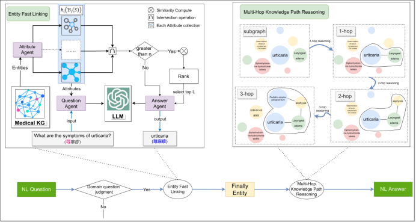

### README
### LLM-KGMQA:  Large Language Model-Augmented Multi-Hop Question-Answering System based on Knowledge Graph in Medical Field




## Overview 
LLM-KGMQA is a novel multi-hop question-answering system designed to enhance the performance of large language models (LLMs) in domain-specific fields like medicine. It integrates knowledge graphs (KGs) to address challenges such as entity linking and multi-hop knowledge path reasoning, offering an effective approach to domain-specific question-answering tasks.

## Key Innovations
1. **Entity Linking**  
   - A fast-linking algorithm is introduced that categorizes entities based on multiple attributes.
   - The algorithm uses user-provided mentions to define a target set of attributes and narrows down the search space via attribute intersection.
   - For remaining entities, a pre-trained model calculates similarity scores to rank and identify the final entity.

2. **Multi-Hop Knowledge Path Reasoning**  
   - A three-step reasoning framework is proposed, including:
     - **Hop Subgraph Construction**: Builds the relevant subgraphs for each hop in the reasoning process.
     - **Knowledge Fusion**: Combines different sources of knowledge to enhance the reasoning process.
     - **Semantics-Based Knowledge Pruning**: Prunes irrelevant knowledge based on semantic analysis, improving the reasoning process.

## Performance & Results
- **Entity Linking**: 
   - The use of attribute intersection reduced computational complexity by 99.90%.
   - The entity linking accuracy achieved 96.60%, with a CRA@n score of 96.40% and an nDCG score of 99.80% when using the RoBERTa model for similarity calculations.
  
- **Multi-Hop Knowledge Path Reasoning**:
   - The GLM4 model exhibited the best performance for Chinese semantic reasoning.
   - After applying the pruning technique, the accuracy improved significantly:
     - 1-hop: 99.90% (from 95.00%)
     - 2-hop: 83.30% (from 6.60%)
     - 3-hop: 86.60% (from 5.00%)
   - The average response time was reduced by 1.36s, 6.21s, and 27.07s for 1-hop, 2-hop, and 3-hop respectively after pruning.

## Requirements

- Python 3.8+
- PyTorch
- Other libraries: `py2neo`, `ahocorasick`, `scipy`, etc.

## Installation

1. Clone the repository:

   ```bash
   git clone https://github.com/wfl0325/LLM-KGMQA.git
   cd LLM-KGMQA
   ```

2. Install dependencies:

   ```bash
   pip install -r requirements.txt
   ```

## Examples

1. **Example Question**: "我发现我有脑错裂伤怎么办?"
2. **Example Question**: "接触性荨麻疹有哪些症状?"
3. **Example Question**: "老年人多发性骨髓瘤的并发症的治疗药品有哪些?"